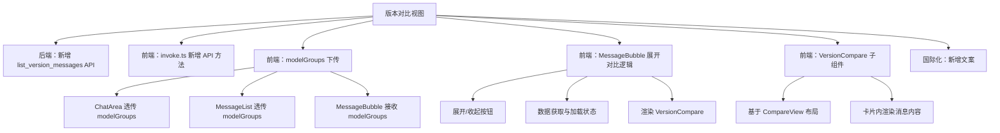
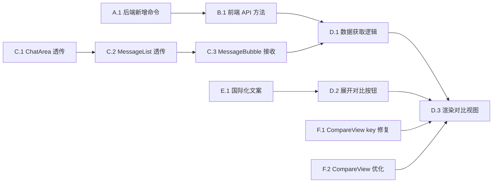

# 功能规划：AI 消息版本对比视图

**规划时间**：2026-03-11
**预估工作量**：10 任务点

---

## 1. 功能概述

### 1.1 目标
在 AI 消息多版本（totalVersions > 1）的版本按钮组中新增「展开对比」按钮。点击后以横向并排滚动卡片展示所有版本内容，再次点击收起。

### 1.2 范围
**包含**：
- 版本按钮组新增「展开对比」按钮
- 点击后获取所有版本的完整消息内容
- 以横向并排滚动卡片展示所有版本（复用 CompareView 卡片布局）
- 卡片标题显示模型名称（modelId 解析）
- 再次点击收起对比视图

**不包含**：
- 版本间差异高亮（diff 对比）
- 对比视图内的编辑/删除操作
- 对比视图内的版本切换交互

### 1.3 技术约束
- Svelte 5 runes 语法
- 复用已有 CompareView.svelte 的卡片布局
- 数据获取需要新增后端 API（当前 `list_versions` 命令只返回 VersionInfo，不含 content）
- modelId 到 modelName 的解析需要 modelGroups 数据，目前 MessageBubble 无法访问

---

## 2. 方案分析与选型

### 2.1 数据获取方案

**核心问题**：MessageBubble 只有当前版本的 message，展开对比需要所有版本的完整消息内容。

**方案 A：MessageBubble 内部直接调用 API**
- 优点：自包含，不需要改动父组件链
- 缺点：模型名称解析需要 modelGroups，需要额外传入或重新获取

**方案 B：通过 onAction 向父组件发出 action，父组件获取数据后传回**
- 优点：数据流单向清晰，符合现有架构模式
- 缺点：需要在 MessageBubble、MessageList、ChatArea、+page.svelte 四层组件间传递数据

**方案 C（推荐）：新增后端 API 返回完整版本消息 + MessageBubble 内部调用，modelGroups 通过 props 传入**
- 在后端新增 `list_version_messages` 命令，直接返回 `Message[]`（`db::messages::list_versions` 已能返回完整 Message，只需一个新的 Tauri command 暴露它）
- MessageBubble 新增可选 prop `modelGroups`，用于 modelId -> modelName 解析
- MessageBubble 内部管理展开/收起状态和数据加载
- 优点：改动最小，不改变现有 action 数据流，后端改动仅一个新 command

**选型结论**：采用方案 C。

理由：
1. `db::messages::list_versions` 已经返回完整 `Message` 对象（含 content, reasoning 等），但现有 `list_versions` Tauri command 只提取了 `VersionInfo`。只需新增一个 command 暴露完整数据即可。
2. MessageBubble 内部管理对比状态更简洁，避免了在四层组件间传递版本消息数组。
3. modelGroups 已经在 +page.svelte 存在，只需沿 ChatArea -> MessageList -> MessageBubble 传递下来。

### 2.2 分解结构图

---

## 3. WBS 任务分解

### 模块 A：后端 API（1 任务点）

#### 任务 A.1：新增 `list_version_messages` Tauri command（1 点）

**文件**：`src-tauri/src/commands/conversation.rs`

- **输入**：`versionGroupId: string`
- **输出**：`Message[]`（所有版本的完整消息，含 content、reasoning 等）
- **关键步骤**：
  1. 新增 `list_version_messages` 函数，调用已有的 `db::messages::list_versions(conn, &version_group_id)`
  2. 直接返回 `Vec<Message>`（`list_versions` 已返回完整 Message 对象）
  3. 在 `src-tauri/src/lib.rs` 的 `invoke_handler` 中注册新命令

**关键发现**：`db::messages::list_versions` 的 SQL 查询已经选取了完整的消息列（包括 content、reasoning、model_id 等），并通过 `row_to_message_with_total` 解析为 `Message`。当前的 `list_versions` command 只提取了 3 个字段（version_number, model_id, id），我们需要一个新 command 来暴露完整的 Message。

### 模块 B：前端 API 层（0.5 任务点）

#### 任务 B.1：在 invoke.ts 新增 API 方法（0.5 点）

**文件**：`src/lib/utils/invoke.ts`

- **输入**：后端命令名称
- **输出**：`api.listVersionMessages(versionGroupId): Promise<Message[]>`
- **关键步骤**：
  1. 在 `api` 对象的 Versions 区块新增 `listVersionMessages` 方法
  2. 调用 `invoke('list_version_messages', { versionGroupId })`
  3. 返回类型为 `Promise<Message[]>`

### 模块 C：modelGroups 属性下传（1.5 任务点）

#### 任务 C.1：ChatArea 透传 modelGroups（0.5 点）

**文件**：`src/lib/components/chat/ChatArea.svelte`

- **输入**：ChatArea 已有 `modelGroups` prop
- **输出**：将 modelGroups 传递给 MessageList
- **关键步骤**：
  1. 在 `<MessageList>` 标签上新增 `{modelGroups}` 属性

**分析**：ChatArea 已经接收 `modelGroups` prop（第 28 行），只需在 `<MessageList>` 渲染时传入。

#### 任务 C.2：MessageList 透传 modelGroups（0.5 点）

**文件**：`src/lib/components/chat/MessageList.svelte`

- **输入**：新增 `modelGroups` prop
- **输出**：传递给每个 MessageBubble
- **关键步骤**：
  1. Props 类型中新增 `modelGroups?: ModelGroup[]`
  2. 引入 `ModelGroup` 类型
  3. 在 `<MessageBubble>` 渲染时传入 `{modelGroups}`

#### 任务 C.3：MessageBubble 接收 modelGroups（0.5 点）

**文件**：`src/lib/components/chat/MessageBubble.svelte`

- **输入**：新增可选 prop `modelGroups`
- **输出**：内部可用于 modelId -> modelName 解析
- **关键步骤**：
  1. 引入 `ModelGroup` 类型
  2. Props 类型新增 `modelGroups?: ModelGroup[]`
  3. 在 let 解构中接收 `modelGroups = []`
  4. 添加 `resolveModelName(modelId)` 辅助函数，遍历 modelGroups 查找 model.name，未找到时 fallback 为 modelId

### 模块 D：MessageBubble 对比功能（4 任务点）

#### 任务 D.1：新增展开对比状态与数据获取逻辑（1.5 点）

**文件**：`src/lib/components/chat/MessageBubble.svelte`

- **输入**：message.versionGroupId, message.totalVersions
- **输出**：展开/收起状态，版本消息数组
- **关键步骤**：
  1. 新增 `let isCompareExpanded = $state(false)`
  2. 新增 `let compareMessages = $state<Message[]>([])`
  3. 新增 `let isLoadingCompare = $state(false)`
  4. 实现 `toggleCompare()` 异步函数：
     - 如果已展开则收起（设 isCompareExpanded = false）
     - 如果收起则调用 `api.listVersionMessages(groupId)` 获取数据
     - 设置 loading 状态
     - 获取成功后设置 compareMessages 并展开
  5. 组装 `compareResponses` derived：将 compareMessages 映射为 `{ modelId, modelName, message }[]`，使用 `resolveModelName` 解析模型名

#### 任务 D.2：添加「展开对比」按钮到版本按钮组（1 点）

**文件**：`src/lib/components/chat/MessageBubble.svelte`

- **输入**：版本按钮组区域（第 413-426 行）
- **输出**：按钮组末尾新增「展开对比 / 收起对比」按钮
- **关键步骤**：
  1. 引入 `Columns2Icon`（或 `GitCompareArrowsIcon`）自 lucide-svelte
  2. 在版本按钮组 `{#each}` 循环后，添加分隔线和对比按钮
  3. 按钮样式与现有版本按钮保持一致，增加图标
  4. 按钮文案：展开时显示 i18n.t.collapseCompare，收起时显示 i18n.t.expandCompare
  5. 加载中时显示 loading 状态（禁用按钮 + spinner）
  6. 按钮 onclick 调用 `toggleCompare()`

#### 任务 D.3：渲染对比视图区域（1.5 点）

**文件**：`src/lib/components/chat/MessageBubble.svelte`

- **输入**：compareResponses, isCompareExpanded
- **输出**：对比卡片 UI
- **关键步骤**：
  1. 在版本按钮组下方、消息内容上方（或下方，取决于 UX），添加条件渲染块 `{#if isCompareExpanded && compareResponses.length > 0}`
  2. 渲染 `<CompareView responses={compareResponses} />`
  3. 引入 CompareView 组件
  4. 确保对比视图在消息气泡宽度范围内可横向滚动

### 模块 E：国际化（0.5 任务点）

#### 任务 E.1：新增对比相关文案（0.5 点）

**文件**：`src/lib/stores/i18n.svelte.ts`

- **输入**：现有 messages 对象
- **输出**：新增 expandCompare / collapseCompare 文案
- **关键步骤**：
  1. zh 语言新增：`expandCompare: '展开对比'`, `collapseCompare: '收起对比'`
  2. en 语言新增：`expandCompare: 'Compare versions'`, `collapseCompare: 'Collapse compare'`

### 模块 F：CompareView 适配（2.5 任务点）

#### 任务 F.1：CompareView 支持版本对比场景（1 点）

**文件**：`src/lib/components/chat/CompareView.svelte`

- **输入**：当前 CompareView 使用 responses 的 modelId 作为 each key
- **输出**：适配版本对比场景（不同版本可能使用相同 modelId）
- **关键步骤**：
  1. 审查 `{#each responses as resp (resp.modelId)}` -- 当多个版本使用相同 model 时 key 会重复导致渲染问题
  2. 方案：给 responses 数组项新增可选 `key` 字段，或使用 index 作为 key
  3. 推荐：修改 each key 为 `resp.message.id`（消息 ID 必定唯一）
  4. 卡片标题栏：在模型名称旁显示版本号（如 "GPT-4o (v1)"），需要新增 versionLabel 可选字段或从 message.versionNumber 读取

#### 任务 F.2：CompareView 卡片内容展示优化（1.5 点）

**文件**：`src/lib/components/chat/CompareView.svelte`

- **输入**：当前 CompareView 内嵌 MessageBubble 渲染
- **输出**：卡片内正确展示完整消息内容（含 reasoning）
- **关键步骤**：
  1. 当前 CompareView 内部使用 `<MessageBubble message={resp.message} />` 渲染，MessageBubble 会渲染版本按钮组和操作按钮
  2. 在对比视图内应该禁用版本按钮组和操作按钮，避免嵌套交互混乱
  3. 方案：CompareView 给 MessageBubble 传 `disabled={true}`，这样 showAssistantActions 为 false
  4. 版本按钮组的问题：即使 disabled=true，版本按钮组仍然会渲染（因为它只依赖 totalVersions > 1）。需要在 MessageBubble 中加一个条件：CompareView 内的消息不显示版本按钮组
  5. 方案：新增 `hideVersionControls?: boolean` prop 给 MessageBubble，CompareView 中传入 `hideVersionControls={true}`

---

## 4. 依赖关系

### 4.1 依赖图

### 4.2 依赖说明

| 任务 | 依赖于 | 原因 |
|------|--------|------|
| B.1 | A.1 | 前端 API 方法依赖后端命令存在 |
| D.1 | B.1, C.3 | 数据获取需要 API 方法和 modelGroups |
| D.2 | E.1 | 按钮文案需要国际化字符串 |
| D.3 | D.1, D.2, F.1, F.2 | 渲染需要数据 + 按钮 + CompareView 适配 |
| C.2 | C.1 | 透传链 |
| C.3 | C.2 | 透传链 |

### 4.3 并行任务

以下任务可以并行开发：
- A.1（后端） ∥ E.1（国际化） ∥ F.1 + F.2（CompareView 适配） ∥ C.1 -> C.2 -> C.3（props 透传链）

---

## 5. 实施建议

### 5.1 技术选型

| 需求 | 推荐方案 | 理由 |
|------|----------|------|
| 对比按钮图标 | `Columns2` from lucide-svelte | 语义明确，表示并排列视图 |
| each key | `resp.message.id` | 消息 ID 唯一，避免相同 modelId 冲突 |
| 隐藏嵌套版本控件 | `hideVersionControls` prop | 最小侵入，不影响现有 disabled 语义 |

### 5.2 潜在风险

| 风险 | 影响 | 缓解措施 |
|------|------|----------|
| 版本数量多时横向滚动卡片过多 | 中 | CompareView 已有 overflow-x-auto，体验可接受；未来可加虚拟化 |
| 对比视图展开后占用大量垂直空间，影响虚拟滚动 height cache | 中 | MessageList 的 ResizeObserver 会自动更新 heightCache，展开/收起时高度变化会被正确追踪 |
| 大量版本消息内容一次性加载 | 低 | 实际版本数一般不超过 5-10 个，数据量可控 |
| CompareView 内 MessageBubble 递归展示版本按钮 | 高 | 必须通过 hideVersionControls prop 阻断，否则出现嵌套对比按钮 |

---

## 6. 任务清单汇总

| # | 任务 | 文件 | 任务点 | 依赖 |
|---|------|------|--------|------|
| A.1 | 后端新增 list_version_messages 命令 | `src-tauri/src/commands/conversation.rs`, `src-tauri/src/lib.rs` | 1 | - |
| B.1 | 前端 invoke.ts 新增 API 方法 | `src/lib/utils/invoke.ts` | 0.5 | A.1 |
| C.1 | ChatArea 透传 modelGroups | `src/lib/components/chat/ChatArea.svelte` | 0.5 | - |
| C.2 | MessageList 透传 modelGroups | `src/lib/components/chat/MessageList.svelte` | 0.5 | C.1 |
| C.3 | MessageBubble 接收 modelGroups + resolveModelName | `src/lib/components/chat/MessageBubble.svelte` | 0.5 | C.2 |
| D.1 | 展开对比状态与数据获取逻辑 | `src/lib/components/chat/MessageBubble.svelte` | 1.5 | B.1, C.3 |
| D.2 | 展开对比按钮 UI | `src/lib/components/chat/MessageBubble.svelte` | 1 | E.1 |
| D.3 | 渲染对比视图 | `src/lib/components/chat/MessageBubble.svelte` | 1.5 | D.1, D.2, F.1, F.2 |
| E.1 | 国际化文案 | `src/lib/stores/i18n.svelte.ts` | 0.5 | - |
| F.1 | CompareView key 修复 + 版本号标题 | `src/lib/components/chat/CompareView.svelte` | 1 | - |
| F.2 | CompareView 内隐藏版本控件 | `src/lib/components/chat/CompareView.svelte`, `src/lib/components/chat/MessageBubble.svelte` | 1.5 | - |

---

## 7. 验收标准

- [ ] 当 AI 消息 totalVersions > 1 时，版本按钮组中显示「展开对比」按钮
- [ ] 点击「展开对比」后，横向并排展示所有版本的完整消息内容（含 reasoning）
- [ ] 每个卡片标题正确显示模型名称和版本号
- [ ] 再次点击按钮可收起对比视图
- [ ] 对比视图内的消息卡片不显示版本按钮组和操作按钮
- [ ] 中英文文案正确
- [ ] 加载中有 loading 状态提示
- [ ] 展开/收起不影响虚拟滚动的高度追踪

---

## 8. 建议实施顺序

1. **第一批**（并行）：A.1 + E.1 + F.1 + F.2 + C.1
2. **第二批**（依赖第一批）：B.1 + C.2 + C.3
3. **第三批**（依赖第二批）：D.1 + D.2
4. **第四批**（最终组装）：D.3
