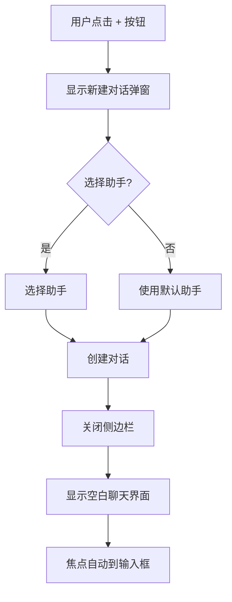
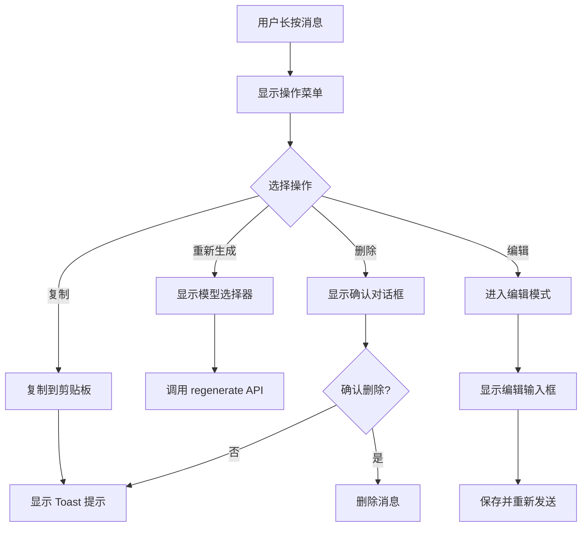
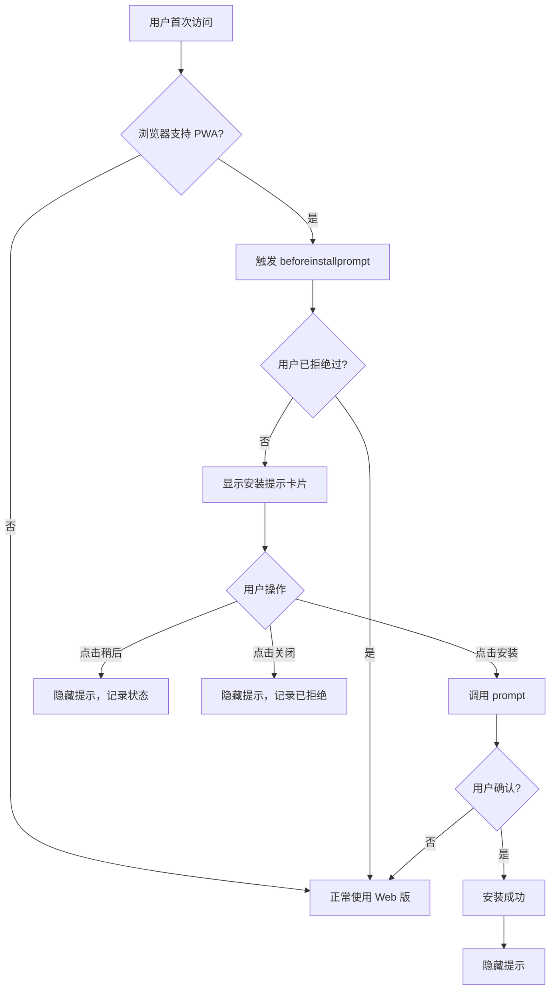

## 8. 页面结构设计（移动端）

### 8.1 主页面结构（Mobile）

```
+------------------------------------------+
|  [≡] Orion Chat              [+] [...]   | ← MobileHeader (safe-area-top)
+------------------------------------------+
|                                          |
|  MessageList (虚拟滚动)                  |
|  - 上拉加载更多历史消息                  |
|  - 下拉刷新（可选）                      |
|                                          |
|  [加载更多...]                           |
|                                          |
|  +------------------------------------+  |
|  | User Message                       |  |
|  +------------------------------------+  |
|                                          |
|  +------------------------------------+  |
|  | Assistant Message                  |  |
|  | [Copy] [Regenerate] [Delete]       |  | ← 长按显示
|  +------------------------------------+  |
|                                          |
+------------------------------------------+
|  [📎] [输入消息...]            [发送]    | ← ChatInput (safe-area-bottom)
+------------------------------------------+
```

### 8.2 侧边栏抽屉（Mobile Drawer）

```
+------------------------------------------+
|  [×] 对话列表                            | ← DrawerHeader
+------------------------------------------+
|  [🔍] 搜索对话...                        |
+------------------------------------------+
|                                          |
|  📌 置顶对话                             |
|  +------------------------------------+  |
|  | 重要项目讨论                       |  |
|  | 最后消息：好的，我来帮你...        |  |
|  | 2 分钟前                           |  |
|  +------------------------------------+  |
|                                          |
|  📅 今天                                 |
|  +------------------------------------+  |
|  | 如何实现 PWA                       |  |
|  | 最后消息：首先需要...              |  |
|  | 1 小时前                           |  |
|  +------------------------------------+  |
|                                          |
|  📅 昨天                                 |
|  ...                                     |
|                                          |
+------------------------------------------+
|  [⚙️ 设置] [👤 助手] [📊 统计]           | ← DrawerFooter
+------------------------------------------+
```

### 8.3 设置页面（Mobile）

```
+------------------------------------------+
|  [←] 设置                                | ← 返回按钮
+------------------------------------------+
|                                          |
|  🤖 模型服务                             |
|  > OpenAI Compatible                     |
|  > Anthropic                             |
|                                          |
|  👤 助手设置                             |
|  > 管理助手                              |
|                                          |
|  🎨 显示设置                             |
|  > 主题：跟随系统                        |
|  > 语言：简体中文                        |
|                                          |
|  💾 数据管理                             |
|  > 导出数据                              | ← Web 模式
|  > 清除缓存                              |
|                                          |
|  ℹ️ 关于                                 |
|  > 版本：0.3.4                           |
|  > 检查更新                              | ← Web 模式隐藏
|                                          |
+------------------------------------------+
```

---

## 9. 交互流程设计

### 9.1 移动端新建对话流程



### 9.2 移动端消息操作流程



### 9.3 PWA 安装流程



---

## 10. 状态管理

### 10.1 移动端特有状态

```typescript
// src/lib/stores/mobile.svelte.ts
let _sidebarOpen = $state(false);
let _showMessageActions = $state<string | null>(null); // 当前显示操作菜单的消息 ID

export const mobile = {
  get sidebarOpen() {
    return _sidebarOpen;
  },
  set sidebarOpen(value: boolean) {
    _sidebarOpen = value;
  },
  get showMessageActions() {
    return _showMessageActions;
  },
  set showMessageActions(value: string | null) {
    _showMessageActions = value;
  },
};
```

### 10.2 PWA 状态

```typescript
// src/lib/stores/pwa.svelte.ts
let _isInstalled = $state(false);
let _deferredPrompt = $state<any>(null);

if (typeof window !== 'undefined') {
  // 检测是否已安装
  _isInstalled = window.matchMedia('(display-mode: standalone)').matches;

  window.addEventListener('beforeinstallprompt', (e) => {
    e.preventDefault();
    _deferredPrompt = e;
  });
}

export const pwa = {
  get isInstalled() {
    return _isInstalled;
  },
  get canInstall() {
    return _deferredPrompt !== null;
  },
  async install() {
    if (!_deferredPrompt) return false;
    _deferredPrompt.prompt();
    const { outcome } = await _deferredPrompt.userChoice;
    _deferredPrompt = null;
    return outcome === 'accepted';
  },
};
```

---

## 11. 无障碍访问（A11y）

### 11.1 移动端 A11y 要点

| 实践 | 实施方法 |
|------|---------|
| 触摸目标尺寸 | 所有按钮至少 44x44px |
| 焦点管理 | 侧边栏打开时焦点移到第一个对话 |
| 屏幕阅读器 | 使用 `aria-label` 描述图标按钮 |
| 键盘导航 | 支持 Tab 导航（外接键盘） |
| 动态内容通知 | 使用 `aria-live` 通知新消息 |

### 11.2 示例代码

```svelte
<!-- 移动端汉堡菜单按钮 -->
<button
  onclick={() => mobile.sidebarOpen = true}
  class="touch-target"
  aria-label="打开对话列表"
  aria-expanded={mobile.sidebarOpen}
>
  <Menu class="w-5 h-5" />
</button>

<!-- 侧边栏 Drawer -->
<Drawer
  bind:open={mobile.sidebarOpen}
  onOpenChange={(open) => {
    if (open) {
      // 焦点移到第一个对话
      setTimeout(() => {
        document.querySelector('[data-conversation-item]')?.focus();
      }, 100);
    }
  }}
>
  <DrawerContent
    role="dialog"
    aria-label="对话列表"
    class="..."
  >
    <!-- 内容 -->
  </DrawerContent>
</Drawer>

<!-- 消息列表：动态内容通知 -->
<div
  role="log"
  aria-live="polite"
  aria-atomic="false"
>
  {#each messages as message}
    <MessageItem {message} />
  {/each}
</div>
```

---

## 12. 性能优化

### 12.1 移动端性能要点

| 优化项 | 实施方法 |
|--------|---------|
| 虚拟滚动 | 使用 `@tanstack/svelte-virtual`（已有） |
| 图片懒加载 | `loading="lazy"` |
| 代码分割 | 设置页面按需加载 |
| 减少重绘 | 使用 `will-change` 优化动画 |
| 减少 JS 体积 | Tree-shaking、压缩 |

### 12.2 Service Worker 缓存策略

| 资源类型 | 策略 |
|---------|------|
| HTML/JS/CSS | 缓存优先（Cache First） |
| API 请求 | 仅网络（Network Only） |
| 图片/字体 | 缓存优先，失败时网络 |

---

## 13. 开发交付清单

### 13.1 前端改造

- [ ] 创建 API 抽象层（`src/lib/api/`）
- [ ] 添加环境检测（`platform.ts`）
- [ ] 实现 Web API（`web/impl.ts`）
- [ ] 实现 SSE 流式处理（`web/sse.ts`）
- [ ] 添加 PWA Manifest（`static/manifest.json`）
- [ ] 创建 Service Worker（`src/service-worker.ts`）
- [ ] 修改 HTML Head（`src/app.html`）
- [ ] 添加 InstallPrompt 组件
- [ ] 创建 viewport store（`viewport.svelte.ts`）
- [ ] 添加 viewport height fix
- [ ] 添加安全区域 CSS 工具类
- [ ] 改造 AppSidebar 支持 Drawer
- [ ] 添加 MobileHeader 组件
- [ ] 修复 ChatInput 软键盘问题
- [ ] 替换 hover 为长按操作
- [ ] 隐藏 Tauri 专属设置项
- [ ] 替换文件选择器为 Web 版本

### 13.2 后端 API（需要新增）

- [ ] 实现 RESTful API（对应所有 Tauri commands）
- [ ] 实现 SSE 流式响应（`/api/messages/send`）
- [ ] 添加身份认证（JWT/Session）
- [ ] 添加 CORS 配置
- [ ] 实现文件上传（替代 Tauri 文件选择器）

### 13.3 Docker 部署

- [ ] 编写 Dockerfile（前端 + 后端）
- [ ] 编写 docker-compose.yml
- [ ] 配置环境变量
- [ ] 添加数据持久化（volume）
- [ ] 编写部署文档

---

## 14. 测试清单

### 14.1 功能测试

- [ ] Tauri 桌面端：所有功能正常
- [ ] Web 桌面端：所有功能正常
- [ ] Web 移动端：所有功能正常
- [ ] PWA 安装：iOS Safari、Android Chrome
- [ ] 离线功能：Service Worker 缓存生效
- [ ] 流式响应：SSE 正常工作

### 14.2 兼容性测试

| 平台 | 浏览器 | 版本 | 测试项 |
|------|--------|------|--------|
| iOS | Safari | 15+ | PWA 安装、安全区域、软键盘 |
| Android | Chrome | 108+ | PWA 安装、通知 |
| Desktop | Chrome | 最新 | 完整功能 |
| Desktop | Firefox | 最新 | 完整功能 |
| Desktop | Safari | 最新 | 完整功能 |

### 14.3 性能测试

- [ ] Lighthouse 评分 > 90（Performance、Accessibility、Best Practices、PWA）
- [ ] 首屏加载 < 2s（3G 网络）
- [ ] 消息列表滚动流畅（60fps）
- [ ] 虚拟滚动正常工作（1000+ 消息）

---

## 15. 风险与挑战

### 15.1 技术风险

| 风险 | 影响 | 缓解措施 |
|------|------|---------|
| SSE 连接不稳定 | 流式响应中断 | 添加重连机制、心跳检测 |
| iOS Safari PWA 限制 | 功能受限 | 提前测试，文档说明 |
| Service Worker 缓存问题 | 更新不及时 | 版本化缓存、强制更新机制 |
| 移动端性能 | 低端设备卡顿 | 虚拟滚动、懒加载、节流 |

### 15.2 用户体验风险

| 风险 | 影响 | 缓解措施 |
|------|------|---------|
| 移动端操作不习惯 | 用户流失 | 添加引导提示、手势教程 |
| PWA 安装率低 | 推广困难 | 优化安装提示时机、文案 |
| 离线功能误解 | 用户困惑 | 明确提示在线/离线状态 |

---

## 16. 后续优化方向

### 16.1 短期（1-2 个月）

- 添加消息搜索（移动端优化）
- 支持语音输入（Web Speech API）
- 支持图片粘贴/上传
- 添加消息引用/回复功能

### 16.2 中期（3-6 个月）

- 支持多人协作（WebSocket）
- 添加消息分享功能
- 支持 Markdown 实时预览
- 添加快捷短语（移动端）

### 16.3 长期（6+ 个月）

- 支持插件系统（Web 版）
- 添加数据同步（多设备）
- 支持自定义主题
- 添加统计分析面板

---

## 附录 A：关键代码片段

### A.1 统一 API 入口（完整版）

```typescript
// src/lib/api/index.ts
import { isTauri } from './platform';

// 类型定义
export type { ApiInterface, ChatEvent, ChatEventHandler, AppPaths } from './types';

// 运行时选择实现
export const api = (() => {
  if (isTauri()) {
    // Tauri 环境
    const { invoke, Channel } = require('@tauri-apps/api/core');
    return createTauriApi(invoke, Channel);
  } else {
    // Web 环境
    return createWebApi();
  }
})();

function createTauriApi(invoke: any, Channel: any) {
  // 封装现有 invoke.ts 逻辑
  return {
    createConversation(title, assistantId, modelId) {
      return invoke('create_conversation', { title, assistantId, modelId });
    },
    // ... 其他方法
  };
}

function createWebApi() {
  // Web HTTP 实现
  return {
    async createConversation(title, assistantId, modelId) {
      const response = await fetch('/api/conversations', {
        method: 'POST',
        headers: { 'Content-Type': 'application/json' },
        body: JSON.stringify({ title, assistantId, modelId }),
      });
      return response.json();
    },
    // ... 其他方法
  };
}
```

### A.2 移动端侧边栏（完整版）

```svelte
<!-- src/lib/components/sidebar/AppSidebar.svelte -->
<script lang="ts">
  import { isMobile } from '$lib/stores/viewport.svelte';
  import { Drawer, DrawerContent } from '$lib/components/ui/drawer';
  import { SidebarProvider, Sidebar } from '$lib/components/ui/sidebar';
  import SidebarContent from './SidebarContent.svelte';

  let { activeConversationId, onConversationSelect } = $props();
  let mobileOpen = $state(false);
</script>

{#if isMobile()}
  <!-- 移动端：Drawer 模式 -->
  <Drawer bind:open={mobileOpen}>
    <DrawerContent class="w-[280px] h-full">
      <SidebarContent
        {activeConversationId}
        {onConversationSelect}
        onClose={() => mobileOpen = false}
      />
    </DrawerContent>
  </Drawer>
{:else}
  <!-- 桌面端：现有模式 -->
  <SidebarProvider>
    <Sidebar>
      <SidebarContent
        {activeConversationId}
        {onConversationSelect}
      />
    </Sidebar>
  </SidebarProvider>
{/if}
```

---

## 附录 B：目录结构（完整）

```
orion-chat-rs/
├── src/
│   ├── lib/
│   │   ├── api/
│   │   │   ├── index.ts              # 统一 API 入口
│   │   │   ├── platform.ts           # 环境检测
│   │   │   ├── types.ts              # 共享类型定义
│   │   │   ├── tauri/
│   │   │   │   └── impl.ts           # Tauri 实现
│   │   │   └── web/
│   │   │       ├── impl.ts           # Web 实现
│   │   │       ├── sse.ts            # SSE 工具
│   │   │       └── config.ts         # Web 配置
│   │   ├── components/
│   │   │   ├── pwa/
│   │   │   │   └── InstallPrompt.svelte
│   │   │   ├── mobile/
│   │   │   │   ├── MobileHeader.svelte
│   │   │   │   └── MobileDrawer.svelte
│   │   │   ├── sidebar/
│   │   │   │   ├── AppSidebar.svelte  # 改造
│   │   │   │   └── SidebarContent.svelte
│   │   │   ├── chat/
│   │   │   │   ├── ChatArea.svelte    # 改造
│   │   │   │   ├── ChatInput.svelte   # 改造
│   │   │   │   └── MessageItem.svelte # 改造
│   │   │   └── settings/
│   │   │       ├── ProviderSettings.svelte # 改造
│   │   │       └── DataSettings.svelte     # 改造
│   │   ├── stores/
│   │   │   ├── viewport.svelte.ts    # 新增
│   │   │   ├── mobile.svelte.ts      # 新增
│   │   │   └── pwa.svelte.ts         # 新增
│   │   └── utils/
│   │       ├── invoke.ts             # 改为 re-export
│   │       └── viewport.ts           # 新增
│   ├── routes/
│   │   ├── +layout.svelte            # 改造
│   │   ├── +layout.ts                # 改造
│   │   └── +page.svelte              # 改造
│   ├── app.html                      # 改造
│   ├── app.css                       # 改造
│   └── service-worker.ts             # 新增
├── static/
│   ├── manifest.json                 # 新增
│   ├── icons/                        # 新增
│   │   ├── icon-72x72.png
│   │   ├── icon-192x192.png
│   │   ├── icon-512x512.png
│   │   └── maskable-icon-512x512.png
│   └── screenshots/                  # 新增
│       ├── desktop.png
│       └── mobile.png
├── docs/
│   └── plans/
│       └── 2026-03-13-web-pwa-migration-design.md
├── svelte.config.js                  # 改造
└── package.json                      # 添加依赖
```

---

## 总结

本设计方案提供了将 Orion Chat 从 Tauri 桌面应用改造为支持 Web/PWA 的完整路径，核心要点：

1. **统一代码库**：通过 API 抽象层实现 Tauri/Web 双模式
2. **渐进式改造**：不影响现有桌面端功能，逐步添加 Web 支持
3. **移动端优化**：响应式布局、触摸交互、安全区域适配
4. **PWA 增强**：离线缓存、安装提示、类原生体验
5. **性能保证**：虚拟滚动、懒加载、Service Worker 缓存

实施顺序建议按 Phase 1-4 进行，每个阶段都可独立测试和部署。
